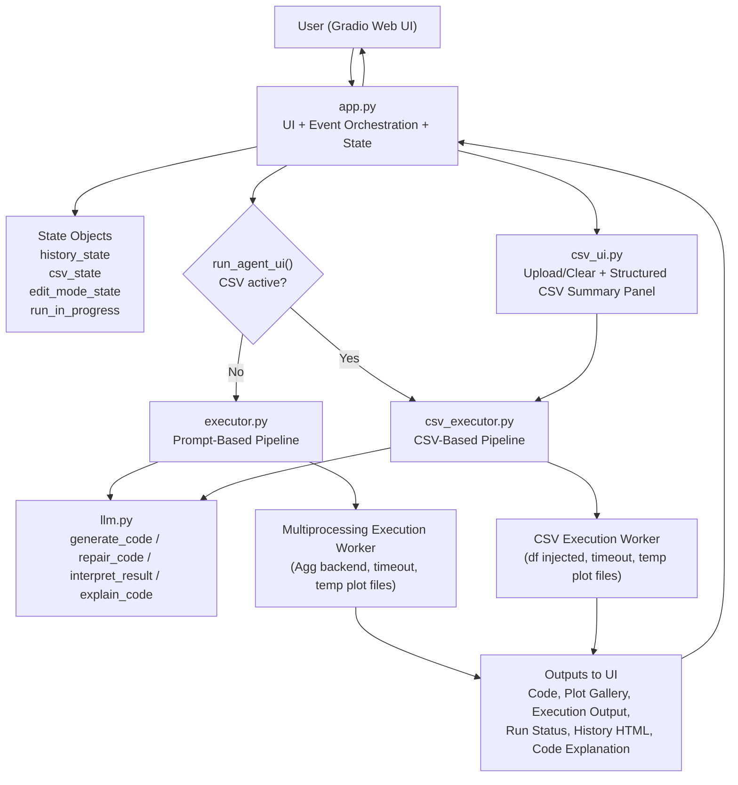

# AI Data Analysis Agent

https://huggingface.co/spaces/wakaranaino/data-analysis-agent

An agentic Gradio web app that converts natural-language analysis requests into Python code, executes that code with safeguards, and returns:

- generated Python code
- execution output
- plots
- concise interpretation
- conversation history

The app supports both prompt-based analysis and file-based CSV analysis in one interface.

## Project Description
This project demonstrates an end-to-end LLM-assisted data analysis workflow:

1. User enters a request (or uploads CSV + asks questions).
2. LLM generates Python code.
3. Code is executed in a controlled worker process with timeout.
4. If execution/validation fails, the app asks the LLM to repair code and retries.
5. Results are rendered in UI panels (plot, output, code, history).

The goal is to provide a practical data-analysis agent with clear safeguards, retry logic, and transparent outputs.

## Core Features
- Dual routing:
  - prompt-based execution pipeline
  - CSV-based execution pipeline
- CSV upload session with sticky in-memory dataframe (`df`) until cleared/restarted
- Structured CSV summary panel:
  - overview metrics
  - data types / column groups
  - low-cardinality subgroup values (categorical samples)
  - missing values summary
  - preview table
- Self-correction:
  - retry + repair loop for failed code
- Cancelable run UX:
  - submit toggles to cancel while running
- Multi-plot support in output gallery
- Chat-style conversation history with separate system note line

## Architecture Diagram


## Repository Structure
- `app.py`: UI layout, event wiring, routing, and panel rendering
- `executor.py`: prompt-mode orchestration (validate → generate → run → repair → interpret)
- `csv_executor.py`: CSV load/session state + CSV execution/repair pipeline
- `csv_ui.py`: CSV upload/clear handlers and structured summary formatting
- `llm.py`: model calls, prompt templates, code extraction, repair prompts, interpretation
- `requirements.txt`: pinned runtime dependencies

## How to Run This Project
### Option 1: Use the live Hugging Face demo
If you only want to use the app, open the deployed Space link. No local setup is required.

### Option 2: Run locally (developer setup)
Clone this repo, then:
```bash
python3 -m venv .venv
source .venv/bin/activate
pip install -r requirements.txt
```

Set environment variables:

- `GROQ_API_KEY` (required)
- `GROQ_URL` (optional; defaults to Groq OpenAI-compatible endpoint)

Model settings are currently in `llm.py`:
- `MODEL_SIMPLE`
- `MODEL_COMPLEX`
- `MODEL_CSV`

Run:
```bash
python app.py
```

### Option 3: Deploy your own Hugging Face Space (optional)
This repo includes Spaces metadata in this `README.md` header:
- `sdk: gradio`
- `sdk_version: 6.11.0`
- `app_file: app.py`

On Spaces:
1. Push project files.
2. Add `GROQ_API_KEY` in Space Secrets.
3. Restart Space.

Do not upload `.env` to the repo.

## Example Prompts
### Prompt-based mode (Scenarios A / C)
- `Fetch the last 100 days of Apple (AAPL) stock closing prices. Plot a line chart with dates on the x-axis. Then calculate and display: mean, median, standard deviation, min, and max price.`
- `Compare the monthly returns of Tesla (TSLA) and Microsoft (MSFT) over the past year. Show both on the same chart and run a t-test to see if the mean returns are significantly different.`

### CSV mode (after upload, Scenario B)
- `Analyze this dataset. Show me the first 5 rows, data types for each column, any missing values, and a histogram of 'score'.`

### Self-correction test (Scenario D style)
- `Using uploaded CSV, compute the mean of column "scroe" grouped by Classification.`
  - (`scroe` intentionally misspelled to trigger repair/retry)

## Safety and Reliability
- Input validation for blocked prompt patterns
- Generated/edited code validation for blocked operations
- Execution timeout in worker process
- Retry/repair loop on runtime or validation failure
- Post-execution checks for low-value/invalid outputs (for example NaN stats, empty-result signals)

Note:
- This project uses safeguarded local worker execution (`multiprocessing`) with validation/timeouts.
- It is not a full containerized sandbox policy system (like isolated Docker/E2B per request).

## Known Limitations
- LLM output quality still depends on prompt clarity and dataset quality.
- Ambiguous requests may require one retry cycle or user clarification.
- CSV analysis assumes the uploaded dataframe is represented as `df` at execution time.
- Current safeguards are practical but not equivalent to strict OS-level sandbox isolation.
- Large datasets and complex plots may increase response time.
- History rendering is UI-focused and may require additional UX polish for very long chats.

## Scenario Mapping
- Scenario A: prompt-based data query and plot generation
- Scenario B: CSV upload + summary + file-based analysis
- Scenario C: statistical tests/comparisons
- Scenario D: agentic self-correction via repair + rerun
- Scenario E: unique capabilities
  - structured CSV summary panel
  - manual code edit and rerun
  - code explanation panel
 
## AI-Assisted Development
AI tools were used as development assistants throughout this project under human supervision.

- ChatGPT: used for project planning, architecture discussion, debugging, iterative code drafting, and design decisions.
- Codex: used for larger code changes during later development stages, especially CSV feature expansion and UI refinement, after reviewing implementation plans first.
- Claude: used occasionally for targeted troubleshooting on specific UI/Python issues and for drafting an initial version of the project report.
- Verification Process: AI-generated code and writing were reviewed manually. Report content was cross-checked for accuracy, unsupported claims, and inconsistencies before final revision.

All final decisions, integration steps, testing, and submissions were completed by the project author.
